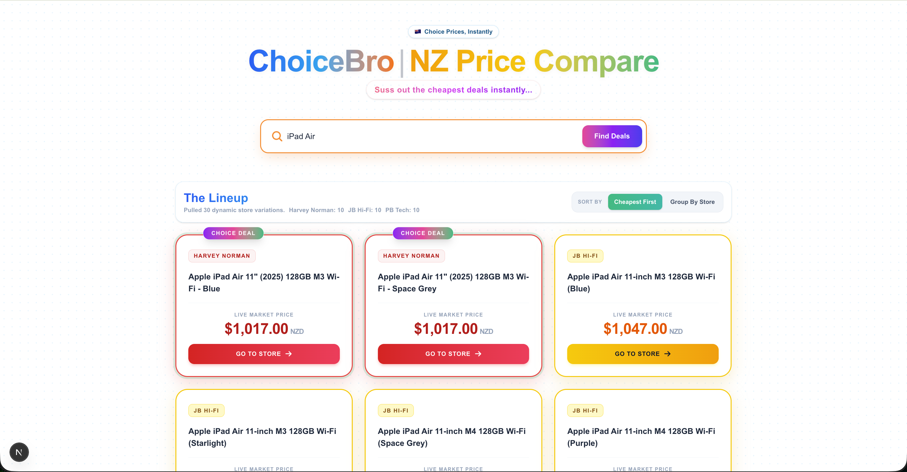

# ChoiceBro | NZ Price Compare

> Suss out the absolute cheapest tech and appliances across PB Tech, JB Hi-Fi, Harvey Norman, and more – instantly.



## 🌟 Overview

ChoiceBro is a real‑time price comparison tool for New Zealand shoppers. Enter any product, and it scrapes live prices from multiple local retailers, then presents them in a fun, Kiwi‑flavoured UI. No database, no history – just fresh prices every time.

**Live demo:** [Coming soon](#)

## ✨ Features

- 🔍 **Real‑time search** – scrapes retailers on demand
- 🏬 **Multi‑retailer support** – PB Tech, Harvey Norman, JB Hi‑Fi (Noel Leeming and Mighty Ape ready but behind Cloudflare)
- 💰 **Smart sorting** – cheapest first or group by store
- 🎨 **Store‑specific theming** – each retailer gets its own colour scheme
- 📱 **Fully responsive** – works great on mobile, tablet, and desktop
- ⚡ **Fast, lightweight** – no heavy frameworks, just Next.js + Tailwind
- 🧠 **Clever caching** – in‑memory cache to reduce repeated scraping (5 minutes TTL)

## 📦 Installation

### Prerequisites
- Node.js 18+ and npm/yarn/pnpm
- A hosting environment that supports Puppeteer (not Vercel)

### Steps

```bash
# 1. Clone the repository
git clone https://github.com/AungKhantKyaw/choice_bro.git
cd choice_bro

# 2. Install dependencies
npm install

# 3. Run the development server
npm run dev

# 4. Open http://localhost:3000
```

# Project Structure

choicebro-nz-price-compare/
├── app/
│   ├── api/
│   │   └── search/
│   │       └── route.ts          # API endpoint that orchestrates scrapers
│   ├── layout.tsx                # Root layout with metadata and background
│   ├── page.tsx                  # Main UI (search form + results)
│   └── globals.css               # Tailwind + custom animations
├── lib/
│   ├── scrapers/
│   │   ├── pbtech.ts             # PB Tech scraper
│   │   ├── harveyNorman.ts       # Harvey Norman scraper
│   │   ├── jbhifi.ts             # JB Hi-Fi scraper (Puppeteer)
│   ├── orchestrator.ts           # Runs all scrapers concurrently
│   └── types.ts                  # Shared TypeScript interfaces
├── public/                       # Static assets
├── package.json
├── tsconfig.json
├── tailwind.config.js
└── README.md


# 🤙 Just a heads up, bro! (Disclaimer)
ChoiceBro is an entirely non-commercial, free project built for the love of coding and bargain hunting. I don't earn a single cent off this application!

Because retail platforms update inventories and clear items dynamically, prices found here may vary slightly from real-time checkout displays on merchant domains. Users are always encouraged to double-check final values natively at checkout.

# 📄 License
This project is open-source and free to play around with. Fork it, tweak it, add your favorite local store, and happy hunting!