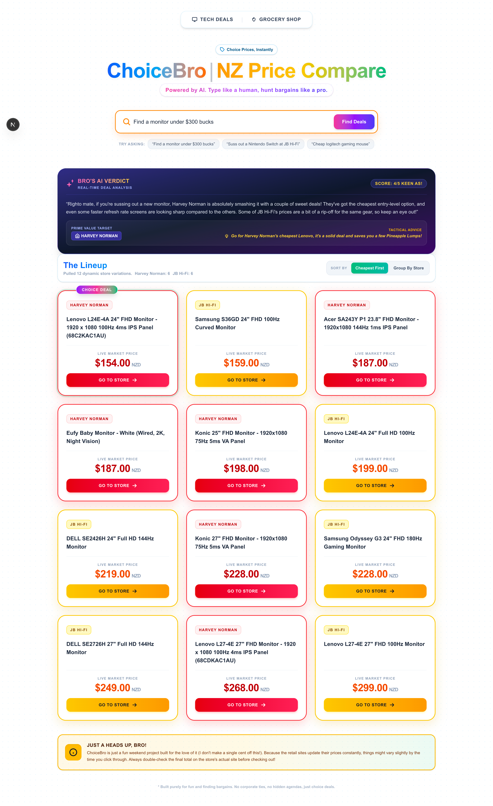

# ChoiceBro | NZ Price Comparison Engine

> Suss out the absolute cheapest deals across New Zealand's top tech, appliance, and grocery retailers — instantly.

ChoiceBro is an intelligent, real-time price comparison engine designed specifically for Kiwi bargain hunters. Enter casual queries, and ChoiceBro leverages Gemini AI to extract your search intent (budget, brand, specific items), queries live listings concurrently via high-performance headless scrapers, and presents the data in a beautiful, brand-matched Kiwi dashboard.

---



---

## Key Highlights

### Tech Comparative Engine
* **Coverage:** Live scrapers for **PB Tech**, **JB Hi-Fi**, and **Harvey Norman**.
* **Smart Routing:** Intelligently extracts store keywords (e.g., *"sony headphones at PB Tech"*) to only fire target scrapers, cutting query time by **3x**.
* **Brand Styling:** Results are dynamically themed matching each retailer's signature colors (e.g. JB yellow/amber, PB Tech cyan/emerald).

### Supermarket Comparative Engine (New!)
* **Coverage:** Live scrapers for **PAK'nSAVE**, **New World**, and **Woolworths**.
* **Brand Filter:** Advanced token matching automatically filters out unrelated items (e.g. searching *"Pams Butter"* isolates the Pams brand, filtering out Mainland or Anchor).
* **Resilient Selectors:** Utilizes class-agnostic, data-testid traversal methods to survive e-commerce platforms' dynamic CSS hash updates.

### Gemini AI Verdict Engine
* **Bro's AI Verdict:** Reviews compiled listings in real-time, assigning a deal rating (e.g. *Good Deal, Average, Steal*) and summarizing recommendations.
* **Casual Parsing:** Translates informal conversational queries (e.g., *"Find a cheap mechanical keyboard under $150 bucks"*) into precise search parameters.

### Under-The-Hood Optimizations
* **Stealth & Evasions:** Evades anti-bot telemetry by removing `navigator.webdriver`, spoofing Chrome runtime specs, and injecting mock browser lang/plugin configurations.
* **Fast Interception:** Puppeteer blocks images, stylesheets, fonts, tracking pixels (Facebook/TikTok ads), and analytic networks (Google Tag Manager, Sentry) for rapid data extraction.
* **Segmented Caching:** Persistent JSON-based local cache segmented by search queries and store preferences with a 4-hour time-to-live (TTL).

---

## Project Structure

```text
choice_bro/
├── app/
│   ├── api/                       # Thin route files: each delegates to lib/api/handlers.ts
│   │   ├── chat/ search/ verdict/             # Tech
│   │   └── grocery/{chat,search,verdict}/     # Grocery
│   ├── grocery/page.tsx           # Grocery UI
│   ├── page.tsx                   # Tech UI
│   └── layout.tsx, globals.css, icon.svg
├── lib/
│   ├── api/handlers.ts            # chat / search / verdict handlers, parametrised by category
│   ├── ai.ts                      # Gemini query parsing + verdicts (prompts per category)
│   ├── retailers.ts               # Retailer registry: URLs, ready-checks, deadlines, store aliases
│   ├── scrape.ts                  # Runs one retailer: Puppeteer -> HTML -> extractor -> Product[]
│   ├── scrapers/extractors.ts     # Pure HTML extractors (unit-tested against fixtures)
│   ├── search.ts                  # Per-retailer cache, in-flight dedupe, filtering, failure reporting
│   ├── filters.ts                 # Grocery brand-keyword filter
│   ├── browser.ts                 # Shared Chromium + bounded page pool (SCRAPER_MAX_PAGES, default 4)
│   ├── types.ts
│   └── utils/                     # fileCache, retry, timeout (deadline + abort), semaphore, price, units
└── package.json
```

**Adding a retailer:** write an extractor in `lib/scrapers/extractors.ts`, add an entry to
`RETAILERS` in `lib/retailers.ts`, and add a fixture + test. Nothing else needs to change.

**Behaviour notes**
* Cache is per retailer + query (4h TTL). Only *successful* scrapes are cached, so a blocked scrape is retried next time rather than served stale; a retailer that failed shows up as a warning in the UI.
* Each scrape has a hard deadline; on timeout its page is closed, not left running.
* `maxPrice` and store filtering happen server-side. Grocery results include a best-effort unit price parsed from the title.
* Tests: `npm test`. Fixtures in `lib/scrapers/__fixtures__/` are hand-written; see the README there.

---

## Getting Started

### Prerequisites
* **Node.js** 18+ and `npm` installed.
* An environment capable of running Puppeteer (headless Chromium).

### Installation Steps

1. **Clone the Repository**
   ```bash
   git clone https://github.com/AungKhantKyaw/choice_bro.git
   cd choice_bro
   ```

2. **Install Dependencies**
   ```bash
   npm install
   ```

3. **Configure Environment Variables**
   Create a `.env.local` file in the root directory and add your Gemini API Key:
   ```env
   GEMINI_API_KEY=your_gemini_api_key_here
   ```

4. **Launch the Development Server**
   ```bash
   npm run dev
   ```
   Open [http://localhost:3000](http://localhost:3000) in your browser. Use the header tabs to toggle between **Tech Deals** and the **Grocery Shop**.

---

## Heads up, bro! (Disclaimer)

ChoiceBro is a free, non-commercial developer playground built for the love of coding, open-source web scraping, and bargain hunting. 

Because retailers constantly modify prices, inventories, and page layouts, prices displayed here might occasionally vary from a merchant's real-time checkout values. Always double check before completing checkout!

## License

This project is open-source and free to adapt. Fork it, add your favorite Kiwi storefronts, and happy deal hunting!
